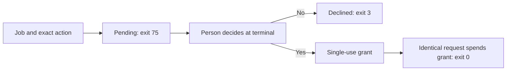

# May

**Ask a person before one exact action proceeds.**

May is a small approval gate for shell programs. It displays the proposed
action and returns an exit status your program can branch on. With a job name,
it can park the request for later and consume a single-use approval when the
same job asks for the same action again.

May does not execute the action or decide whether it is safe. It answers one
question: did a person approve these exact bytes?

## Install

Requires **Go 1.26+** and **Unix or WSL**. Install current `main`:

```sh
mkdir -p "$HOME/.local/bin"
GOBIN="$HOME/.local/bin" go install github.com/patrickyoung/may@main
export PATH="$HOME/.local/bin:$PATH"
may check
```

Keep the PATH setting in your shell startup file. `may check` exercises the
gate offline using temporary test state. No model or service account is needed.

## Try an approval at your terminal

```sh
printf '%s\n' 'Print a hello message' | may && printf 'Hello!\n'
```

May shows the quoted action and asks `y/N`. Answer `y` or `yes` to let the
shell print `Hello!`; anything else declines. The action arrives on stdin,
while your answer comes from `/dev/tty`, so a pipe cannot approve itself.

This example gates only the following print. A real connector must describe
its exact intended effect and execute only after May returns 0.

## Let a person decide later

Give the request a stable job name:

```sh
printf '%s\n' 'Print a hello message' | may hello-demo
```

The first call exits **75**: the request is saved, awaiting a person. Inspect it:

```sh
may pending
```

Copy the full `digest` from that JSON record and decide it at your terminal:

```sh
may decide DIGEST
```

After approval, repeat the identical request:

```sh
printf '%s\n' 'Print a hello message' | may hello-demo && printf 'Hello!\n'
```

It spends the one matching grant and exits 0. Calling again needs a new
approval. Changing the job name, words, spaces, or final newline changes the
request and cannot use the old grant.



## Connect it to other tools

| Tool | How May fits |
| --- | --- |
| [Action](https://github.com/patrickyoung/action) | Reviews one exact connector request before release |
| [Ply](https://github.com/patrickyoung/ply) | `-may-job JOB` gates each model-authored shell action |
| [Agent](https://github.com/patrickyoung/agent) | Reviews definition amendments and external-effect proposals |
| [Tend](https://github.com/patrickyoung/tend) | Keeps a process durably waiting while a person decides |
| [Cage](https://github.com/patrickyoung/cage) | Supplies a separate write/network execution boundary |

For controllers that need a machine-readable result:

```sh
printf '%s\n' 'Print a hello message' | may request hello-demo
```

`request` has the same consuming transition as `may JOB`. Its strict JSON
contains `version`, `job`, `digest`, `action`, and a `verdict` of `parked`,
`declined`, or `spent`. The status must agree with the result. JSON is evidence
of the decision, not a way to provide approval.

## State you can inspect

```text
~/.local/state/may/
  pending/      waiting for a decision
  granted/      approved, not yet spent
  declined/     refused
  spent/        consumed grants
  audit.jsonl   append-only transitions and decisions
```

State records both the words and their digest. The digest is SHA-256 over
`may-v1`, NUL, job, NUL, and exact action bytes. A grant is consumed by atomic
rename before May returns 0. There is no config file or state-directory
environment override.

Actions must be nonempty UTF-8 without NUL, up to 16 KiB; job names are bounded
at 1 KiB. A job named like a command can be passed after `--`.

May and its state are operator capabilities. Keep them outside model toolboxes
and worker-writable sandboxes. Approval does not confine the action or protect
against a caller that describes one operation and performs another.

Clerk ships a different worker-specific program also named `may`, with its own
chat approval interface and state. Do not replace standalone May with that
program on a shared PATH.

## Outcomes and reference

| Exit | Meaning |
| --- | --- |
| 0 | Exact action approved; a named-job grant has been spent |
| 1 | `may check` found a failure |
| 2 | Invalid input, usage, corrupt state, or I/O failure |
| 3 | Declined, or no terminal available for immediate approval |
| 75 | Named request durably parked for a person |

A missing terminal is a refusal, never approval. Native Windows builds refuse
terminal decisions; deploy the Unix contract under WSL instead.

```text
may [JOB]                 # action on stdin
may request JOB           # same transition, JSON result
may pending
may decide DIGEST
may check
may help
may version
```

See [GUIDE.md](GUIDE.md), [may.1](may.1), and [SECURITY.md](SECURITY.md).
Contributors: read [AGENTS.md](AGENTS.md), run `go test ./...`,
`go test -race ./...`, `go vet ./...`, build, and run `may check`.
[MIT license](LICENSE).
