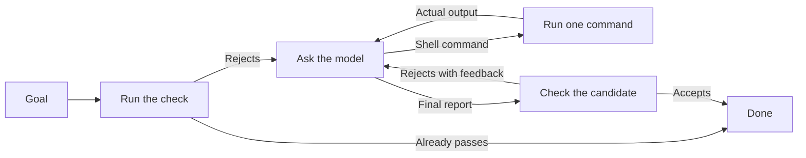

# Ply

**Give a model a goal, give it some programs, and let a check decide when the work is done.**

Ply asks a model what to do, runs its shell command, returns the actual result,
and repeats. When the model offers a final answer, your check accepts it or
sends it back with feedback. This makes tasks such as repairing a failing test
usable from an ordinary shell script.

```sh
ply -sh -check 'go test ./...' 'Fix the failing tests.'
```

The final answer is stdout. Commands and their results are stderr. With a
check, exit 0 means the check passed. Without one, it means the model stopped.

[Install](#install) · [First checked task](#your-first-checked-task) ·
[Skills and history](#add-a-procedure-and-keep-the-evidence) · [Field guide](GUIDE.md)

## Install

Requires **Go 1.26+**, **Unix or WSL**, and
[Ask](https://github.com/patrickyoung/ask). Install both from current `main`:

```sh
mkdir -p "$HOME/.local/bin"
GOBIN="$HOME/.local/bin" go install github.com/patrickyoung/ask@main
GOBIN="$HOME/.local/bin" go install github.com/patrickyoung/ply@main
export PATH="$HOME/.local/bin:$PATH"
ply version
```

Keep the PATH setting in your shell startup file. Configure Ask with a model
your account supports; replace these placeholders:

```sh
export ASK_MODEL='anthropic/YOUR_MODEL_ID'
export ANTHROPIC_API_KEY='YOUR_API_KEY'
ask 'Reply with hello.'
```

See [Ask's setup](https://github.com/patrickyoung/ask#install) for other
providers and OAuth. Ply makes its model calls through Ask and uses the same
account. It stores no credentials itself.

## Your first checked task

Use a fresh directory so the input and expected result are easy to see:

```sh
mkdir ply-demo
cd ply-demo
printf '%s\n' pear apple pear banana > names.txt

ply -sh -f run.jsonl -turns 8 \
  -check 'test -f sorted.txt && printf "apple\nbanana\npear\n" | diff -u - sorted.txt' \
  'Read names.txt. Write sorted.txt with one name per line, sorted and deduplicated.'

cat sorted.txt
```

Expected file:

```text
apple
banana
pear
```

The check compares exact output with an independently written answer. The
model can choose a method, but it cannot satisfy this check just by saying
that it finished.

Run the same Ply command again. Because the check runs **before the first
model turn**, an already correct result exits 0 without calling a model.

`-sh` grants ordinary shell access with your user permissions. Use a workspace
where you intend the model to run commands; see the boundary options below.


[Static version of the diagram](docs/readme/flow.png). This illustrates the workflow; it is not a recorded run.

## Understand the loop



Each turn contributes one command or one report. Ply executes the first
complete shell block and returns its result before another turn. Extra blocks
and trailing claims are deferred. An incomplete block runs nothing.

Your verifier receives empty stdin before work and the proposed final report
on stdin afterwards:

| Check status | Ply's response |
| --- | --- |
| 0 | Accept the result |
| 1 | Give the feedback to the model and try again within the limits |
| Anything else, a signal, or timeout | Stop: the verifier is broken |

File and code checks can ignore stdin. Answer checks can read it. Normalize
an underlying program's ordinary negative status to 1 when necessary. The
check runs with the caller's PATH, with any toolbox prepended.

## Choose the tools and limits

| Option | Use it for |
| --- | --- |
| `-sh` | Ordinary programs on your current PATH |
| `-t DIR` | A directory of programs as the model's PATH |
| `-C DIR` | A particular working directory |
| `-turns N` | A model-turn limit; default 50, zero removes it |
| `-cycles N` | A limit on candidate/check cycles |
| `-timeout 90s` | A time limit for each command |
| `-m provider/model` / `-effort NAME` | Pass model policy through to Ask |
| `-verbosity LEVEL` | Ask for concise output by default (`low`); empty uses Ask's default |
| `-goal-file FILE` | Read a private goal from a bounded regular file |

Ply's default instructions request command blocks with minimal narration and
short final reports, while preserving the user's requested detail and complete
artifacts. `-verbosity` / `PLY_VERBOSITY` also passes a response preference to
Ask; supported OpenAI Responses models honor it, and other providers may ignore
it. This controls generated text, unlike `-q`, which only hides the typescript.

A toolbox is an ordinary directory. For example, in a fresh workspace:

```sh
mkdir tools
ln -s "$(command -v cat)" tools/cat
ln -s "$(command -v sort)" tools/sort
ply tools -t tools
ply -t tools -turns 8 'Read names.txt and explain what is duplicated.'
```

**The toolbox is scope, not a sandbox.** Shell builtins, redirection, and
absolute paths still exist. Adding or removing a PATH entry does not confine
the process. [Cage](https://github.com/patrickyoung/cage) or an external OS
boundary supplies confinement.

Commands use `/bin/sh -c`, have no interactive stdin, and run in their own
process group. `-shell` selects another interpreter; `-action-shell` selects
one for model commands only, leaving the verifier separate. These must be
executables accepting `-c`, not command strings. Ply never inherits `$SHELL`.

## Add a procedure and keep the evidence

Install [Brief](https://github.com/patrickyoung/brief) to supply skills:

```sh
GOBIN="$HOME/.local/bin" go install github.com/patrickyoung/brief@main
ply -sh -s go-review -check 'go test ./...' 'Fix the failing tests.'
```

That example requires a `go-review` skill in Brief's catalogue. Use `-s -` to
let Brief choose: offline matching first, then its model selector if needed.
No match leaves the run without a skill and says so.

Inspect a named run with Ask:

```sh
ask replay run.jsonl
ask replay -check run.jsonl
ply capabilities
ply system
```

The conversation is an Ask session. Every candidate verifier outcome is a
typed, sealed `ply.verifier/v2` receipt; output bytes use base64 and are bound
by their decoded-byte digest. Updated readers retain v1 support. Rebuild Ask,
Ply, and receipt consumers together when upgrading. Loaded skills are recorded too. Replay
checks the retained history's integrity, not the wisdom of the verifier or the
truth of the answer. A run without `-check` has no verifier verdict.

[Hone](https://github.com/patrickyoung/hone) can turn a verified recovery into
a reviewed lesson for the next run. [Cite](https://github.com/patrickyoung/cite)
can be the answer verifier when you need exact citation identities.

## Continue longer work

A named session (`-f run.jsonl`) retains conversation. A checkpoint also tracks
the current session after compaction:

```sh
mkdir -p "$HOME/.local/state/ply"
ply -sh -checkpoint "$HOME/.local/state/ply/demo.current" -compact \
  -check './check-result' 'Finish the current task.'
```

Supply your own `./check-result`. Repeating the same invocation resumes its
context, and the pre-check still decides whether work remains. Limits are per
invocation. A checkpoint is not a filesystem snapshot or permission to repeat
an uncertain external effect. Each ordinary action result and rejected check
is appended and sealed before a turn or cycle limit can stop the loop, so resumed
context includes the last observed result. An action proposal never becomes
the final stdout report just because the turn budget ran out.

`-compact-at N` asks Ask to compact proactively at an estimated token count
and implies `-compact`. Choose N below your model's window with space for
output and new evidence. Ask owns this estimate; it is not an exact tokenizer.
The original goal and supplied input are retained in each fresh session before
the checkpoint advances. Inspect usage with
`ask context -json -limit N SESSION`.

`-stream` displays model progress on stderr while the response is generated;
`-q` disables it. Actions still wait for a complete response.
`-steer FILE` reads newly appended, newline-terminated guidance before turns,
after generation, after approval, and after a candidate check. New guidance
defers an unused response or finalization; it does not interrupt a running command or change
the tool grant or verifier. For durable scheduling,
wrap the invocation with [Tend](https://github.com/patrickyoung/tend).

[contrib/job](contrib/job) provides separate start/status/wait/cancel commands
for work that should continue while the loop does something else. It returns
handles and retains output; see [the job guide](contrib/jobs.md). It is an
ordinary optional program, with no job service inside Ply.

[The evaluation harness](eval/README.md) runs paired, repeated task trials
through explicit driver programs and external outcome checks. Deterministic
lifecycle fixtures are reported separately from live model task quality.

## Review actions and constrain writes

`-may-job JOB` asks [May](https://github.com/patrickyoung/may) to authorize
each exact model-authored shell action. Status 75 means it is parked without
execution; inspect `may pending`, run `may decide DIGEST` at a terminal, and
continue the same task. Only a byte-identical proposal can spend that grant.

`-cage` adds action-only confinement and requires both `-may-job` and
`-contract-id`. Place controller state outside the writable workspace:

```sh
mkdir -p "$HOME/.local/state/ply/caged-demo"
PLY_DIR="$HOME/.local/state/ply/caged-demo" \
  ply -sh -C "$PWD" \
  -f "$HOME/.local/state/ply/caged-demo/run.jsonl" \
  -contract-id demo-v1 -may-job demo-v1 -cage \
  -check 'test -s report.txt' 'Create report.txt.'
```

The workspace and private action temp directory are writable; host network
access is denied; **host reads remain unrestricted**. Ask, Brief, May, and
the verifier stay outside Cage. A verifier that executes model-modified code
needs its own appropriate boundary. Approval and confinement receipts remain
in the Ask session. See [SECURITY.md](SECURITY.md) before using this boundary
with untrusted work.

External action adapters can use `-action-boundary-exit N` to stop with 125
when their own boundary fails. Their implementation and authority remain the
operator's responsibility; see the [manual](ply.1).

## More tools, same interface

- [MCP](https://github.com/patrickyoung/mcp) can expose reviewed remote
  capabilities as ordinary executable files for a toolbox.
- [Agent](https://github.com/patrickyoung/agent) adds a standing goal, skills,
  separate work/state directories, checks, and history in one home folder.
- [Bench](https://github.com/patrickyoung/bench) adds a terminal interface for
  negotiating an outcome and following the work.
- [contrib/edit](contrib/edit) provides exact text replacement and patch input.
  It is a separate program; its toolbox also needs Python 3.

When explicitly asked for parallel work, Ply can guide the root model to
launch bounded child Ply processes and collect their results. Children are
ordinary programs, not a team service. Use separate worktrees for independent
writers. `-no-delegate` disables the generic delegation guidance.

## Outcomes and reference

| Exit | Meaning |
| --- | --- |
| 0 | Check passed, or the model stopped when no check was supplied |
| 1 | Usage, provider, infrastructure, or verifier failure |
| 2 | Not done: a check still fails, context is full, or a bound/protocol limit was reached |
| 3 / 75 | Exact action declined / waiting for approval |
| 125 | A confinement or action-boundary failure; effects may exist |
| 130 | Interrupted |

If a run stops at 2, inspect stderr and its session before choosing new
limits. If it stops at 125, investigate the recorded boundary outcome before
any retry. Per-command output is bounded; omitted text is explicitly marked.

```text
ply [flags] goal
ply tools [flags]
ply system [flags] [goal]
ply capabilities
ply version
ply help
```

[GUIDE.md](GUIDE.md) has recipes, [ply.1](ply.1) has every option, and
[DESIGN.md](DESIGN.md) explains the design. Contributors: read
[AGENTS.md](AGENTS.md), run `go test ./...`, and add `go test -race ./...`
for loop or runner changes. [MIT license](LICENSE).
