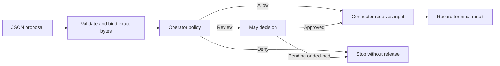

# Action

**Let an agent propose a change. Keep permission and execution in an explicit, inspectable step.**

Creating a ticket, posting a message, or changing a service needs more than
well-written model output. Action takes one exact JSON request, checks the
operator's policy, obtains human review when required, and gives the approved
request to one named connector. It can record the whole decision in the same
Ask session as the task.

The model proposes **what** to do. The controller supplies the connector,
policy, approval path, and credentials that determine **whether and how** it
may happen.

## Install

Requires **Go 1.26+** and **Unix or WSL**. Install current `main` and the
standalone May approval tool:

```sh
mkdir -p "$HOME/.local/bin"
GOBIN="$HOME/.local/bin" go install github.com/patrickyoung/action@main
GOBIN="$HOME/.local/bin" go install github.com/patrickyoung/may@main
export PATH="$HOME/.local/bin:$PATH"
action version
```

Keep the PATH setting in your shell startup file.
[Ask](https://github.com/patrickyoung/ask) is additionally required for
`-record`; the session must already exist. Action itself makes no model call.

## Start with a harmless connector

This example only echoes the approved JSON. It needs no service or credentials.
Run it as the operator in a fresh directory:

```sh
mkdir action-demo
cd action-demo
mkdir connectors
cat > connectors/echo-request <<'SH'
#!/bin/sh
set -eu
case "${1:-}" in
  describe)
    printf '%s\n' '{"version":1,"name":"echo-request","description":"Return the approved input unchanged","input_schema":{"type":"object"}}'
    ;;
  run) cat ;;
  *) exit 2 ;;
esac
SH
chmod +x connectors/echo-request
export ACTION_PATH="$PWD/connectors"

action ls
action show echo-request
```

A connector is just an executable with `describe` and `run`. Discovery tells
you what is available; it does not approve an operation.

## Inspect, approve, then run

Create a proposal naming the connector and input:

```sh
cat > proposal.json <<'JSON'
{"version":1,"connector":"echo-request","input":{"message":"Hello from Action"}}
JSON

action check proposal.json
action inspect proposal.json
```

`check` validates the proposal's shape. `inspect` prints its canonical form.
Neither starts the connector's `run` operation.

Now request execution:

```sh
action run -job echo-demo -proposal proposal.json
```

With no `-policy`, Action sends the exact envelope to May. The first request
parks with **exit 75** and no execution. At a terminal, inspect the pending
request and decide its full digest:

```sh
may pending
may decide DIGEST
```

Replace `DIGEST` with the value printed for `echo-demo`. If you approve, repeat
the identical Action command:

```sh
action run -job echo-demo -proposal proposal.json
```

You should receive `{"message":"Hello from Action"}`. The grant is single-use;
a different input or connector cannot spend it.



## Add real capabilities

Put reviewed connectors on a controller-owned `ACTION_PATH`, a colon-separated
search path. The first matching executable wins. Each connector implements:

```text
CONNECTOR describe   -> one JSON descriptor
CONNECTOR run       <- one complete canonical JSON object on stdin
                    -> one JSON result on stdout
```

A connector must cause no effect before it has read its complete stdin object.
Action fingerprints its executable and descriptor, then checks them again
after authorization before releasing input. Provider-specific behavior stays
inside the connector.

[MCPbox](https://github.com/patrickyoung/mcp) can generate this same interface:

```sh
mcpbox admit service.mcp actions create_ticket
```

Here `service.mcp` is a previously created, inspected capability folder and
`create_ticket` is a tool it exposes. Use its `actions/` directory as
`ACTION_PATH`. MCP annotations do not grant permission.

## Use an operator policy

`-policy /absolute/path/to/policy` selects a program that receives the exact
action envelope on stdin. It returns one strict JSON result and a matching
exit status:

| Status | Decision |
| --- | --- |
| 0 | `allow` |
| 3 | `deny` |
| 75 | `review` through May |

The result includes `version: 1`, the exact `action_sha256`, `decision`, and a
nonempty `reason`. This is an operator-written rule, not a model classifier or
an approval flag. See [DESIGN.md](DESIGN.md) for the full envelope contract.

## Keep the execution evidence

To append to an existing Ask session:

```sh
action run -job ticket-42 -record run.jsonl -proposal ticket.json
ask replay -check run.jsonl
```

Supply an existing `run.jsonl` and an actual proposal. The sealed sequence is:

```text
proposal → decision → prepared attempt → request released → terminal result
```

The corresponding records are `action.proposal/v1`, `action.decision/v1`,
`action.attempt/v1`, `action.sent/v1`, and `action.result/v1`. The connector
starts behind a closed stdin pipe; recording and approval precede release.
Stdout is published only after the terminal result is validated and recorded.

If an effect may have happened but the result cannot be trusted or sealed,
Action exits **125**. Inspect the external service and receipts; do not retry
automatically. Replay verifies retained record integrity, not the business
correctness of the effect.

## Use it with a worker

[Agent](https://github.com/patrickyoung/agent) lets a worker write proposals
under `work/actions/`. The operator reviews and executes them separately:

```sh
agent actions HOME
agent actions HOME ticket.json
AGENT_ACTION_PATH=/operator/owned/actions \
  agent act HOME ticket.json SESSION
```

Replace the home, proposal, session, and connector path with real values.
Agent calls Action outside the worker's Cage boundary. Action, May, policy,
credentials, and controller evidence must stay outside worker-writable roots.
[Context](https://github.com/patrickyoung/context) supplies the complementary
read side: retrieve evidence first, propose an effect afterwards.

## Outcomes and reference

| Exit | Meaning |
| --- | --- |
| 0 / 1 | Trustworthy positive / negative connector result |
| 2 | Invalid or broken before release, or a trustworthy connector rejection |
| 3 | Policy or human denial before release |
| 75 | Pending May decision, or a receipted unfinished connector result |
| 125 | An effect may exist without a trustworthy terminal receipt |
| 130 | Interrupted before release |

```text
action ls
action show NAME
action inspect PROPOSAL.json
action check PROPOSAL.json
action run -job JOB [options] -proposal PROPOSAL.json
action run -job JOB [options] NAME
action help
action version
```

The named-connector form reads its input object from stdin.
See [action.1](action.1), [DESIGN.md](DESIGN.md), and
[SECURITY.md](SECURITY.md). Contributors: read [AGENTS.md](AGENTS.md), then run
`go test ./...`, `go test -race ./...`, and `go vet ./...`.
[MIT license](LICENSE).
