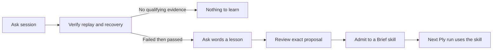

# Hone

**Turn a checked recovery into a lesson the next run can use.**

A useful lesson is more specific than “the task succeeded.” Something failed,
something changed, and a check finally passed. Hone reads that evidence from
an Ask session, asks a model to word the lesson, and can save it as an ordinary
Brief skill.

**Hone learns from recoveries.** A run that never failed offers no recovery to
study. A run that never passed offers no verified resolution. Either can
produce exit 1: there is nothing to learn, and nothing is written.

[Install](#install) · [Inspect a run](#start-with-a-run-that-has-a-check) ·
[Review a lesson](#review-the-exact-lesson-before-saving) · [Field guide](GUIDE.md)

## Install

Requires **Go 1.26+**, **Unix or WSL**, and
[Ask](https://github.com/patrickyoung/ask). Install current `main`:

```sh
mkdir -p "$HOME/.local/bin"
for tool in ask brief hone; do
  GOBIN="$HOME/.local/bin" go install "github.com/patrickyoung/$tool@main"
done
export PATH="$HOME/.local/bin:$PATH"
hone version
```

Keep the PATH setting in your shell startup file. Configure Ask with your
provider/model and credentials before asking Hone to word a lesson. Inspecting
evidence with `-why` does not call a model. Brief validates written skills;
without it, some inspection and wording operations remain available.

## Start with a run that has a check

Use [Ply](https://github.com/patrickyoung/ply) on a real task with an executable
definition of success. For example, from a Go repository with failing tests:

```sh
ply -sh -f repair.jsonl -check 'go test ./...' 'Fix the failing tests.'
ask replay -check repair.jsonl
hone -why repair.jsonl
```

Ply must be installed separately. Its `-sh` option grants shell execution.
Use a check appropriate to your project, and let the run finish before
inspecting it.

`hone -why` shows the replay-verified goal, passing check, and recoveries it
could learn from. It changes no skill and makes no model call. If there is no
qualifying recovery, Hone explains why and exits 1. A clean first attempt,
an unfinished attempt, or a transcript with no verifier verdict is not enough.



The check establishes the task-specific outcome. Replay establishes the
retained record's integrity. Neither makes an inferred lesson universally true;
read it before using it as a future instruction.

## Review the exact lesson before saving

For a qualifying `repair.jsonl`, choose a project-local skill directory:

```sh
mkdir -p .claude/skills
export BRIEF_PATH="$PWD/.claude/skills"
hone -into go-house -prepare lesson.json repair.jsonl
hone show lesson.json
```

Preparation calls Ask and writes a new proposal file. It leaves the installed
skill unchanged. `show` prints the exact proposed skill bytes without a model
call. If the lesson is useful, admit those reviewed bytes:

```sh
hone admit lesson.json
brief cat go-house
brief lint -strict go-house
```

Admission rechecks the source and wording sessions, destination, and hashes,
then writes only the permitted append/scaffold change. A stale proposal is
refused. Existing proposal files are never overwritten; use a new filename
for a new proposal.

Next time, load that procedure explicitly:

```sh
ply -sh -s go-house -check 'go test ./...' 'Fix the next failing test.'
```

## Choose how much to do

| Command | Model call? | Skill write? |
| --- | --- | --- |
| `hone -why repair.jsonl` | No | No |
| `hone -N repair.jsonl` | Yes, if the run qualifies | No |
| `hone -into go-house -prepare lesson.json repair.jsonl` | Yes, if needed | No; creates a proposal |
| `hone show lesson.json` | No | No |
| `hone admit lesson.json` | No | Exact reviewed change only |
| `hone -into go-house repair.jsonl` | Yes, if needed | Direct append/scaffold |

`-N` previews wording, not a durable approval token: a later ordinary call may
produce different words. Use prepare/show/admit when the exact wording matters.
Flags go **before** session paths.

## Keep lessons small and traceable

Each appended lesson carries the ID of the source run and the Ask call that
worded it. A run teaches once; repeating it is detected before another model
call. `-n N` caps lessons per run, defaulting to three. New lessons append under
`## Lessons`; existing instructions are not regenerated.

If a run followed exactly one named skill, `-into -` finds that skill from
Ply's record. Zero or multiple skills are refused rather than guessed:

```sh
hone -into - -prepare lesson.json repair.jsonl
```

Remove lessons from a particular source when review finds them wrong:

```sh
hone forget SOURCE_SESSION_ID go-house
```

Use the source ID recorded in the skill. A skill that accumulates many similar
lessons probably needs a clearer procedure; revise that file and test it on
representative work. Hone does not silently consolidate or rewrite it.

## Where it fits

| Tool | Responsibility |
| --- | --- |
| [Ask](https://github.com/patrickyoung/ask) | Model calls and the session record |
| [Ply](https://github.com/patrickyoung/ply) | Actions, checks, and sealed verifier receipts |
| Hone | Identify qualifying recoveries and word an explicit lesson |
| [Brief](https://github.com/patrickyoung/brief) | Find, read, and lint the resulting skill |
| [Agent](https://github.com/patrickyoung/agent) | Scope learning to a particular worker home |
| [Trail](https://github.com/patrickyoung/trail) | Search the source history |

Hone owns no memory database, index, scheduler, or automatic learning hook.
Lessons remain readable files you can review and version.

## Settings, outcomes, and reference

| Setting | Meaning |
| --- | --- |
| `ASK` / `BRIEF` | Select dependency executables |
| `ASK_DIR` | Session directory, default `~/.ask/sessions` |
| `BRIEF_PATH` | Skill search path; new skills use its first entry |
| `HONE_DIR` | Wording-session directory, default `~/.hone/lessons` |

No session argument uses the current Ask conversation. A directory argument
processes its sessions oldest first. Explicit session paths are easiest to
reason about when you are learning from a particular task.

Exit 0 means a successful requested operation; exit 1 means nothing to learn;
exit 2 means invalid input or an operational failure. Stdout is the requested
lesson, document, or result; stderr explains progress and refusals.

```text
hone [flags] [session ...]
hone forget ID SKILL...
hone show PROPOSAL
hone admit PROPOSAL
hone prompt
hone version
hone help
```

Continue with [GUIDE.md](GUIDE.md) and [hone.1](hone.1). Contributors: read
[AGENTS.md](AGENTS.md), then run `go test ./...` and `go test -race ./...`.
See [SECURITY.md](SECURITY.md). [MIT license](LICENSE).
