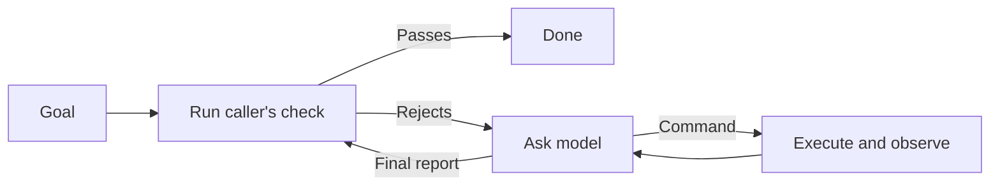

# How the pieces work

[Home](../README.md) · [Tool guide](TOOLS.md) · [Recipes](RECIPES.md)

Suppose you want a weekly support digest. Some parts are already known: which
tickets to read, where to save the draft, and which fields must be present.
The part that needs judgment is deciding which themes matter and explaining
them clearly. Keep the fixed steps in ordinary code; give the model the
judgment step and the evidence it needs.

That separation makes failures easier to locate. A missing ticket is a data
problem. A poor summary is a model or instruction problem. A duplicate send
is an execution problem. Each calls for a different remedy.

## A program has more than one output

The worker's “ID, badge, and computer” correspond to actual boundaries:

| Part | What supplies it | What it does not supply |
| --- | --- | --- |
| ID | The Unix account that runs the process | A persona file does not create an OS identity |
| Badge | Service credentials, operator policy, and selected OS permissions | A skill or discovered tool does not grant access |
| Computer | A workspace, installed programs, and a host that enforces the chosen boundary | A directory alone is not confinement |
| Know-how | Expert instructions, Brief skills, curated memory, and a model | A convincing answer does not prove the job is done |

These commands do not create a Unix account or provision a machine. The
operator supplies them. Agent then binds an expert definition to a workspace
and runs its job using the existing commands.

Most Bench commands use the operating system's three standard streams:

```text
                  instruction (command arguments)
                              |
input file -- stdin --> [ program ] -- stdout --> result file
                              |
                           stderr
                              |
                       progress or errors

The caller also receives an exit status: the program's outcome code.
```

For `ask 'Summarize this' < tickets.txt > digest.md`, the quoted words are
the instruction, `tickets.txt` supplies stdin, and `digest.md` receives stdout.
Stderr stays visible in the terminal. `a | b` connects A's stdout to B's stdin.

These are operating-system interfaces, so Python can use them too:

```python
result = subprocess.run(
    ["ask", "Summarize the important customer problems."],
    input=ticket_text, text=True, capture_output=True,
)
```

This fragment assumes `import subprocess` and a string named `ticket_text`.
Inspect `result.returncode` before using `result.stdout`; diagnostics are in
`result.stderr`. The [meeting-brief starter](../examples/meeting-brief/README.md)
gives a complete example of a caller that preserves the last good output.
Passing arguments as a list also keeps ticket text from becoming shell code.

Files make useful handoff points: save retrieved tickets once, review them,
try another prompt against the same input, and compare the outputs. When you
use a shell pipeline, remember that its default exit status usually comes
from the last command. Separate steps with checked statuses when an upstream
failure matters; a later command cannot infer missing input from an empty file.

## A model call becomes an agent when something executes its actions

**Ask** sends supplied messages to a model and retains the conversation. It
cannot run a command just because the answer contains one. It also cannot
read a file from its name. The caller supplies the contents.

**Ply** adds the feedback loop. It asks through Ask, executes a model-written
command, returns the observed output, and requests the next step. When the
model offers a final report, a check can accept it or return useful feedback.



The pre-check matters. If this week's digest is already complete, the caller
can return without another model turn. The feedback matters too: “missing an
owner for ticket 42” gives the model a specific problem to fix.

A check accepts with status 0, rejects with 1, and stops the loop as broken
with other statuses. A turn limit bounds how many times the model can respond.
Neither a turn limit nor a timeout proves that the result is good.

## An expert folder is the builder's output and the runner's input

**Hire builds. Agent runs.** Hire's builder is itself an expert executed by
Agent. It produces Markdown, skills, optional tools and specialists, and an
executable `bin/check`. Agent binds that definition to the caller's workspace
and passes the work to Brief, Ply, Ask, and Cage.

```text
Job description → Hire → expert folder
                            + workspace + goal → Agent → files and final report
```

The definition can stay the same while each customer case gets a new workspace,
state directory, and run archive. A specialist is another Agent invocation
with its own context. It receives explicitly supplied input, not the parent's
conversation. A shared filesystem can still expose shared files; context
separation is not read isolation.

Try the [support-reply expert](../examples/support-reply/README.md) to see the
whole path. Its citation checker is ordinary code; its writing method is a
skill. Neither needs to duplicate the action loop.

## Workers are reusable; teams select them; runs contain work

The [worker catalog](../workers/README.md) owns individual definitions. A
[team](../teams/README.md) owns a roster and execution wiring, referencing those
workers by ID. Exporting a team at a full Git commit copies the selected source
into a fresh folder; it does not run a model or copy a previous job.

In a managed page team, Page Planner proposes assignments and existing Bench
Manage, Tend and Weave admit and execute them. Each assigned worker runs through
Agent with its own context, workspace and selected inputs. The same Frontend
or Visual Artist definition can be used alone or in another team. The roster
chooses membership; the existing team command defines the cooperation.

Each job gets separate current inputs, outputs, mutable memories and evidence.
Source changes are reviewed through GitHub and selected deliberately for future
exports. A source lock records the starting version. The [library guide](WORKER-LIBRARY.md)
explains assembly, ownership, upgrades and retirement.

A worker or team remains an ordinary command. Optional A2A can expose that
command through the existing authenticated listener, with declared returned
artifacts. Its protocol task/context IDs do not imply shared model conversations
or automatic discovery of team members.

## Instructions, evidence, and authority answer different questions

| Question | The relevant piece | Support-digest example |
| --- | --- | --- |
| How should the work be done? | Brief reads a selected skill; Rules collects applicable instruction files | Use a concise format; preserve customer names |
| What facts should the answer use? | Context normalizes evidence; Ask receives it as message data | The actual tickets, source IDs, and retrieval time |
| Does a citation identify a supplied source? | Cite checks the answer against the saved evidence | A linked ticket must have the exact expected reference and URL |
| May this proposed change happen? | Action applies operator policy; May records human decisions | Review an exact proposal to post the digest |
| Where may a command write or connect? | Cage asks the OS to enforce write/network limits | Draft locally while denying action networking |

A skill is text the model is asked to follow. It is not a permission grant.
A ticket is evidence, even if its text tries to instruct the model. A tool
description advertises an operation; it does not authorize using it.

Likewise, putting a few commands in Ply's toolbox changes what is easy to
find on PATH. It does not prevent shell builtins or absolute-path execution.
Cage supplies an OS write/network boundary, but leaves host filesystem reads
available. Read isolation needs a separate environment designed for that purpose.

## Decide what “done” means before the model starts

Different checks support different claims:

| Evidence | What it establishes | What still needs checking |
| --- | --- | --- |
| A nonempty output file | Some bytes exist | Completeness and correctness |
| Valid JSON matching a schema | The required structure and types | Whether the values are true |
| Cite accepts a report | Citation identities satisfy its rules | Whether the source supports the prose |
| A test suite passes | The tested cases pass | Untested behavior and suitability for use |
| Ask replay verification passes | The retained history is internally consistent | Factual truth and whether history was truncated at a valid boundary |
| A service returns a matching operation receipt | Evidence about that external operation | Any remaining ambiguity under that service's contract |

For a digest, a useful check could verify that every input ticket is accounted
for, required sections exist, and cited IDs belong to the supplied dataset.
A reviewer still judges whether the themes and wording are useful. Choose
checks that reflect the task, not a convenient proxy such as file size.

If the model can rewrite the test that declares it done, a passing test is
weak evidence. Keep the acceptance definition under the caller's control.
This includes code the verifier imports or executes, not just the check's
filename. [Draft](../tools/draft/README.md) has a workflow for designing and
admitting a verifier; review what that verifier actually proves.

## Conversation memory and durable work solve different problems

An Ask session is a conversation record. A Ply checkpoint identifies the
current session to resume, including after compaction. Neither can tell you
whether an unacknowledged external request took effect.

**Agent** runs the expert in a separate workspace or a recurring home.
**Tend** queues and records attempts to run
an ordinary command. A scheduler or caller must invoke `tend work`; Tend does
one durable transition per invocation and exits. A queue alone does not keep
a worker process running.

**Weave** answers a different question: which tasks in a finite dependency
graph are ready, given the supplied observations? It prints those tasks. The
caller validates the observation evidence and passes ready work to an executor.

```text
Task definitions + observed outcomes --> Weave --> ready task records
                                                     |
                                        caller selects/submits a command
                                                     |
                                                    Tend
                                                     |
                                         one recorded command attempt
                                                     |
                                           caller checks the outcome
```

Imagine a digest was posted but the process died before saving the response.
The correct next step is to inspect the destination or use a service-supported
idempotency key, not assume the absence of a local success record means nothing
happened. Tend represents uncertain execution explicitly. Persistence gives
you recoverable evidence; it cannot make every external service exactly-once.

## Start small and add the missing responsibility

Use Ask for a summary. Add Brief when you want to reuse the method. Add Ply
when the next action depends on observed results. Add Agent when the job needs
a maintained home, Tend when attempts must be durable, and Weave when readiness
depends on other tasks. Keep deterministic work in ordinary programs.

Use **MCP** when the missing capability is a service tool and **A2A** when the
worker itself lives on another machine. MCPbox can make reviewed capabilities
available as programs. A2A's client is a filter; its listener is a service
managed by the OS and uses Tend to supervise the local command. Neither needs
another goal loop inside Agent.

The common worker path already has a runner and builder. You still own its
job definition, permissions, check quality, and any application-specific
adapters. The [comparison guide](COMPARISONS.md) explains where that tradeoff
fits alongside integrated assistants and application frameworks.
