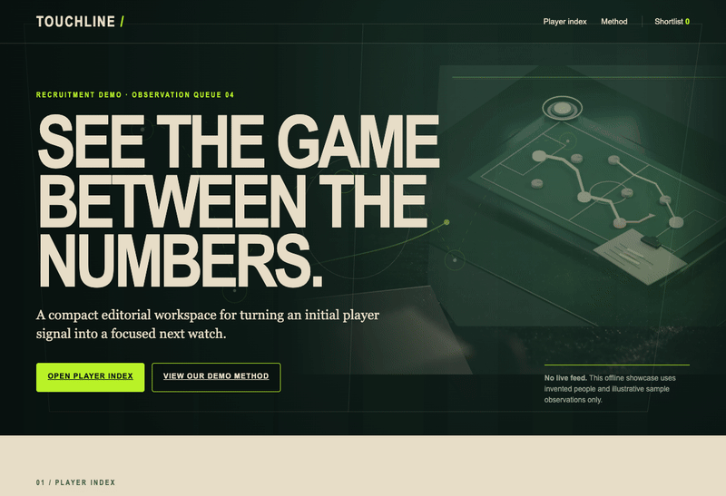

# A page-building team assembled from experts

This is the larger, experimental example: one reusable definition, six focused
specialists, and a manager using the existing Bench Manage application. Hire
builds definitions; Agent runs the manager and every specialist. The local
filter accepts a brief and emits accepted HTML. MCPserve and A2Aserve expose
that same filter when a caller needs those interfaces.

Start with [the observed evaluation](EVALUATION.md). The EPL showcase,
small complete build, protocol tests and extension case have passed. The full
showcase reused checked artwork after iterative repairs; the evaluation records
those failures and limits. This remains an experimental example.



Open [the completed single-file showcase](demo/index.html). Its player data is
illustrative. The recording shows the real page's search, profile, comparison
and shortlist interactions.

## Set up a copy

From the monorepo root, install the existing components:

```sh
python3 scripts/install agent hire ask brief ply cage tend weave mcp a2a
export PATH="$HOME/.local/bin:$PATH"
python3 scripts/workers export-team page-team /absolute/path/to/page-team \
  --ref FULL_COMMIT --allow-experimental
```

`FULL_COMMIT` is the complete reviewed source commit from `git rev-parse HEAD`.
The export includes only the curated definition and its lock, never this
example’s brief, demo or recordings. Supply those inputs separately.

Install [Bench Manage](https://github.com/patrickyoung/bench-manage) separately.
This example was exercised with commit
`347f38dd550aadcba5c8b8890cda6c73f1a5c8a5`. It is an existing Python 3.9+
application composing public commands; it is not a new runtime in this example.
Select the installed monorepo binaries instead of rebuilding sibling checkouts
using its older setup recipe. Keep the application and expert copy unchanged
while a run is admitted.

Set the absolute executable paths in [config/example.env](../../teams/page-team/expert/config/example.env),
export them, and configure [Ask](../../tools/ask/README.md) for your model.
Credentials stay in the operator's provider setup. A harness login by itself
does not configure Ask. Optional existing credential wrappers can be selected
through `AGENT_ASK`; no wrapper is copied into this expert.

The creative case additionally needs Blender, GIMP 3's console and an existing
image-generation executable with the JSON contract in the
[worker setup](../../teams/page-team/expert/README.md). The observed native setup used Blender 5.2.1
and GIMP 3.2.6 on macOS. Linux setup must supply those executables and a working
Cage backend; this evaluation does not claim a fresh Linux-host installation.
Python 3.9+ and Node 22+ must be on the selected process PATH.

In the copied expert folder, install its pinned browser-check dependency:

```sh
cd /absolute/path/to/page-team/expert
npm ci
npx playwright install chromium
```

Alternatively set `PAGE_TEAM_BROWSER` to an installed Chromium executable.
Linux may require Playwright's documented browser system dependencies.

## Run and collect the result

```sh
export PAGE_TEAM_RUN=/absolute/path/to/runs/scouting-001
export PAGE_TEAM_BROWSER_CHECK=/path/to/bench-tools/examples/page-team/tests/showcase-checks.mjs
/absolute/path/to/page-team/expert/bin/page-team \
  < /path/to/bench-tools/examples/page-team/briefs/epl-showcase.md > scouting.html
```

Only exit 0 makes stdout an accepted page. Progress goes to stderr. The run
retains the backlog, independent workspaces and contexts, native masters,
production inputs, image provenance, screenshots and review evidence.
`PAGE_TEAM_RUN/result.html` is the accepted artifact. Resume an existing run
with empty stdin; a changed brief requires a new run. See the
[worker manual](../../teams/page-team/expert/README.md) for limits, confinement and subprocess use.

The [EPL brief](briefs/epl-showcase.md) uses explicitly illustrative scouting
data. It is a showcase, not a source of real recruitment recommendations.

## Have Hire adapt the assembly

Reuse the supplied worker unchanged when it fits. For a different responsibility,
copy the expert into an authoring workspace, then describe the actual changes:

```sh
mkdir /absolute/path/to/authoring
cp -R /absolute/path/to/page-team/expert /absolute/path/to/authoring/expert
hire build -C /absolute/path/to/authoring \
  -evidence /absolute/path/to/authoring-evidence -- \
  'Adapt this existing page team to the supplied brief. Reuse its tools,
   handoffs and interfaces. Choose the smallest useful set of specialists;
   preserve the working checks and add representative cases for the new job.'
hire verify /absolute/path/to/authoring/expert
```

Supply the new job's actual brief on stdin or in the goal. Inspect the changes
and run its cases before selecting the revised copy for execution. Hire's
assembly skill now covers explicit inputs, existing controllers, realistic
context sizes, checked handoffs and retained failures. Hire builds the folder;
the page filter invokes the existing controller and Agent to run it.

## Verify the composition

The deterministic tests call no model or native art tools:

```sh
python3 teams/page-team/tests/contracts.py /absolute/path/to/page-team/expert
node teams/page-team/tests/browser.mjs /absolute/path/to/page-team/expert
```

They reject malformed handoffs, changed hashes, broken review bindings, failed
image capabilities, malformed MCP requests, external browser resources, broken
interactions and unwanted reduced-motion animation. Fixture receipts are
explicitly test data, never claimed as real execution evidence.

For a small live end-to-end test before a creative run, use a fresh run and the
supplied brief generator. This calls the configured model and screenshot judge:

```sh
unset PAGE_TEAM_BROWSER_CHECK
export PAGE_TEAM_RUN=/absolute/path/to/runs/smoke-001
python3 teams/page-team/tests/smoke-brief.py |
  /absolute/path/to/page-team/expert/bin/page-team > fixture.html
cmp fixture.html teams/page-team/tests/browser-fixture.html
```

Use [the interface runbook](INTERFACES.md) for MCP, API and A2A. Use
[the extension example](EXTENDING.md) to add a specialist without changing
Agent, Bench Manage or the worker adapter.
