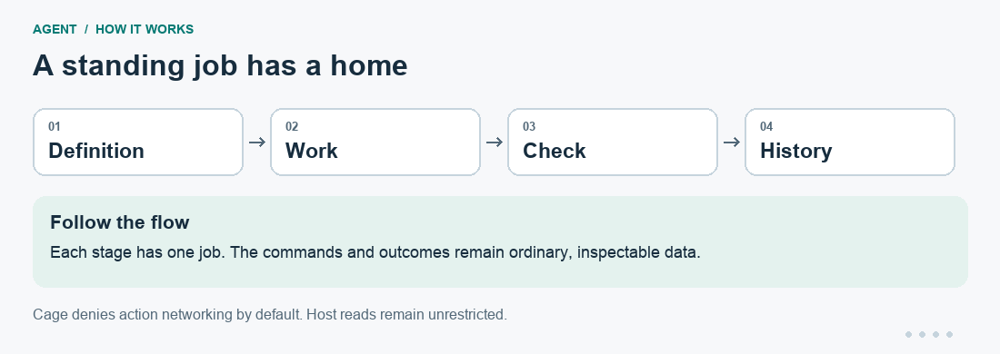

# Agent

**Give a recurring job a home: its instructions, working files, checks, and history.**

A one-off prompt ends when the conversation ends. An Agent home keeps a
standing goal, a procedure, mutable work, and a clear test of success in an
ordinary directory. You can inspect it, version its definition, run it again,
and see the evidence from each attempt.

Agent connects [Brief](https://github.com/patrickyoung/bench-tools/tree/main/tools/brief),
[Ply](https://github.com/patrickyoung/bench-tools/tree/main/tools/ply), [Ask](https://github.com/patrickyoung/bench-tools/tree/main/tools/ask),
and [Cage](https://github.com/patrickyoung/bench-tools/tree/main/tools/cage). The goal lives in Markdown;
`bin/check` decides whether the work is done.

[Install](#install) · [First worker](#build-your-first-worker) ·
[Recurring work](#run-again-or-wake-only-when-needed) ·
[Visual guide](https://patrickyoung.github.io/agent/)

## Install

From the [Bench tools monorepo](https://github.com/patrickyoung/bench-tools),
run `python3 scripts/install agent ask brief ply cage hone trail may action` at the repository root. See
[installation and updates](https://github.com/patrickyoung/bench-tools/blob/main/docs/INSTALL.md)
for prerequisites and PATH setup, or
[getting started](https://github.com/patrickyoung/bench-tools/blob/main/docs/GETTING-STARTED.md)
for a guided first result.

The [Bench application suite](https://github.com/patrickyoung/bench#install)
also includes Agent, with its own pinned companion versions.

**Standalone install.** To work from the independent repositories' current
`main`, you need **Git, a Unix shell, and Go 1.26+**:

```sh
git clone https://github.com/patrickyoung/agent.git
cd agent
mkdir -p "$HOME/.local/bin"
for tool in ask brief ply cage hone trail may action; do
  GOBIN="$HOME/.local/bin" go install "github.com/patrickyoung/$tool@main"
done
ln -s "$PWD/bin/agent" "$HOME/.local/bin/agent"
ln -s "$PWD/bin/agent-action-shell" "$HOME/.local/bin/agent-action-shell"
export PATH="$HOME/.local/bin:$PATH"
agent version
cage check
```

For this standalone route, keep the source checkout in place and the PATH
setting in your shell startup file. If an Agent command is already installed,
use that installation instead of replacing its links blindly.

**After either source installation**, run `cage check`. Linux Cage requires
Bubblewrap and usable kernel namespaces; macOS uses the system Seatbelt backend.

Configure [Ask](https://github.com/patrickyoung/bench-tools/tree/main/tools/ask#install) with a supported
model and credential before running model work. For example, replacing both
placeholders:

```sh
export ASK_MODEL='anthropic/YOUR_MODEL_ID'
export ANTHROPIC_API_KEY='YOUR_API_KEY'
ask 'Reply with hello.'
```

## Build your first worker

This small worker turns a list of names into a sorted, deduplicated file.
There is an exact expected answer, so success is easy to inspect.

```sh
agent new names-worker 'Maintain a clean list of names'
printf '%s\n' pear apple pear banana > names-worker/work/names.txt

cat > names-worker/GOAL.md <<'GOAL'
# Outcome
Read names.txt and write sorted.txt with one name per line, sorted and deduplicated.

## Acceptance evidence
The exact output is apple, banana, pear, each on its own line.

## Constraints
Keep names.txt unchanged. Work only in the mutable work and state directories.
GOAL

cat > names-worker/bin/check <<'SH'
#!/bin/sh
set -eu
test -f sorted.txt || exit 1
printf 'apple\nbanana\npear\n' | diff -u - sorted.txt
SH
chmod +x names-worker/bin/check

agent check names-worker
agent show names-worker
agent run names-worker
cat names-worker/work/sorted.txt
```

`agent check` validates the home's structure; `agent show` prints the compiled
instructions and authority. Neither is a model verdict. `agent run` asks Ply
to pursue the goal until `bin/check` accepts, or a limit/error stops it.
The check runs from `work/` before the first model turn and after a candidate.

Expected result:

```text
apple
banana
pear
```

Run `agent run names-worker` again. A passing pre-check means there is no work
to do and no model call is needed. For a larger job, write a check that covers
its real requirements; a nonempty file alone rarely proves a useful result.



[Static version of the diagram](docs/readme/flow.png). This illustrates the workflow; it is not a recorded run.

## Understand the home

```text
names-worker/
  AGENTS.md       operating instructions
  GOAL.md         standing outcome and constraints
  SOUL.md         optional tone/persona
  PLAN.md         optional strategy
  MEMORY.md       small, curated facts
  HEARTBEAT.md    optional recurring instructions
  skills/         Brief-readable procedures
  tools/          ordinary programs
  agents/         specialist homes
  bin/check       executable definition of done
  bin/wake        cheap probe: quiet, wake, or broken
  work/           mutable inputs and deliverables
    proposals/    definition patches awaiting review
    actions/      external-effect proposals awaiting controller execution
  state/          mutable durable state
  .agent/         controller-owned runs, checkpoints, learning, and receipts
```

Definition, mutable work, and controller evidence are separate write domains.
Agent does not inject every state file into every model call. The worker reads
state when it needs it; memory and skills change through explicit operations.

By default, Cage permits action writes to `work/`, `state/`, and a private
per-action temporary directory, with network denied. **Host reads remain
unrestricted.** `-net` deliberately enables action networking; `-no-cage`
uses the ordinary host boundary. Markdown cannot choose either permission.
The verifier remains outside the action boundary.

## Run again, or wake only when needed

```sh
agent run -checkpoint daily names-worker
agent history names-worker
agent history names-worker check
```

A checkpoint keeps the current Ply/Ask conversation across interruption and
compaction. It is not a snapshot or a reason to repeat an uncertain effect.
History uses Trail and Ask's replay verification without modifying sessions.

For recurring work, fill in `HEARTBEAT.md` and supply `bin/wake`:

| Wake status | Meaning |
| --- | --- |
| 0 | Quiet; no model call or new Ask session |
| 1 | Work is needed; run the heartbeat with the probe's output as evidence |
| Anything else | Broken probe; stop |

`agent tick HOME` runs that process once. Scheduling belongs outside Agent.
[Tend](https://github.com/patrickyoung/bench-tools/tree/main/tools/tend) can durably submit an exact Agent
invocation, retain output, and hold uncertain attempts for review.
[Hire](https://github.com/patrickyoung/bench-hire) adds a web interface for
assigning tasks, reviewing results, and setting routines.

## Give it skills and specialists

Put a skill under `skills/NAME/SKILL.md`. Brief selects from the home's own
catalogue; ambient personal skills are not silently inherited. Programs in
`tools/` are prepended to PATH. An empty skills or tools directory is fine.

Create a separate specialist and edit its goal and check before running it:

```sh
agent new names-worker/agents/reviewer 'Review one bounded result'
agent check names-worker
agent specialist names-worker reviewer -- 'Review the supplied evidence.'
```

A specialist gets its own definition, check, state, and history. It does not
inherit the parent's conversation. Supply actual evidence explicitly; the
example task text is not permission to inspect arbitrary private context.
Specialist invocation is an external controller operation, not an escape
from a parent's network-denied action process.

## Improve through review

For a home session that failed and later passed its verifier:

```sh
agent learn -into house -why HOME SESSION.jsonl
agent learn -into house -prepare recovery.json HOME SESSION.jsonl
agent learn -show recovery.json HOME
agent learn -admit recovery.json HOME
```

Replace `HOME` and `SESSION.jsonl` with a real home and one of its run files.
Hone owns the recovery test. Inspection and admission make no model call;
preparation words a lesson and saves exact bytes for review. Exit 1 can mean
nothing useful was learned. Source teaching and curated facts are distinct
from verified-recovery learning.

A worker may also write one proposed root-definition patch under
`work/proposals/`. `agent proposals HOME PATCH` shows it without applying it.
`agent amend HOME PATCH` validates it and asks May for exact approval. A parked
request exits 75; decide its digest at a terminal and retry the same amendment.
Agent rechecks the hashes, applies it, validates the home, and rolls back on
failure. Evidence stays under `.agent/amendments/`.

## Keep external effects explicit

```sh
agent actions HOME
agent actions HOME ticket.json
AGENT_ACTION_PATH=/operator/owned/actions \
  agent act HOME ticket.json SESSION.jsonl
```

The worker prepares strict proposals under `work/actions/`; the controller
executes them through Action and May outside Cage. Credentials, connector
paths, policy, and approval state stay out of the worker's environment.
Exit 125 means an effect may exist without a trustworthy result: inspect
before retrying.

## Reference and learning resources

`agent help` lists every command: `agent new`, `agent check`, `agent show`,
`agent run`, `agent tick`, `agent specialist`, `agent learn`, `agent history`,
`agent actions`, `agent act`, `agent proposals`, `agent amend`, and `agent version`.
Run flags include `-m`, `-effort`, `-checkpoint`, `-net`, `-no-cage`, and `-q`.

Run/specialist preserve Ply outcomes: 0 accepted, 1 broken, 2 unfinished.
Other operations preserve their component's status, including 75 for approval
pending and 125 for an uncertain effect/boundary. `AGENT_ASK`, `AGENT_PLY`,
`AGENT_BRIEF`, `AGENT_CAGE`, `AGENT_HONE`, `AGENT_TRAIL`, `AGENT_MAY`, and
`AGENT_ACTION` select exact dependency executables.

- [Guided business-process tutorial](https://patrickyoung.github.io/agent/guide.html)
- [System-builder skills](plugins/bench-system-builder/README.md) for guided design and operation
- [MCP integration](MCP.md), [design](DESIGN.md), and [security boundary](SECURITY.md)
- [Evaluation corpus](eval/README.md) for offline behavior checks

Contributors: read [AGENTS.md](AGENTS.md), then run
`sh -n bin/agent bin/agent-action-shell` and `sh bin/agent_test.sh`.
[MIT license](LICENSE).
