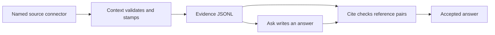

# Context

**Give an answer its sources. Keep those sources usable all the way through the pipeline.**

Before answering “can this customer export their data?”, save the policy the
answer will rely on. Context retrieves evidence through executable connectors and gives the
results a common shape: content, source identity, retrieval time, and a citation.
A document can stay a document; a table can stay a table. Your model receives
the evidence, and a later reader can see where it came from.

```sh
context query wikipedia 'How does a ring buffer work?' > evidence.jsonl
```

You choose the source. Context retrieves and validates; it does not answer the
question or decide which source is authoritative.
The Wikipedia command above requires the connector installed below; the
first example needs only Context and a local file.

## Install

From the [Bench tools monorepo](https://github.com/patrickyoung/bench-tools),
run `python3 scripts/install context` at the repository root. See
[installation and updates](https://github.com/patrickyoung/bench-tools/blob/main/docs/INSTALL.md)
for prerequisites and PATH setup, or
[getting started](https://github.com/patrickyoung/bench-tools/blob/main/docs/GETTING-STARTED.md)
for a guided first result.

**Standalone install.** Requires **Go 1.26+** and **Unix or WSL**. Install
current `main`:

```sh
mkdir -p "$HOME/.local/bin"
GOBIN="$HOME/.local/bin" go install github.com/patrickyoung/context@main
export PATH="$HOME/.local/bin:$PATH"
context version
```

Keep the PATH setting in your shell startup file. The binary and connectors
are separate: installing the binary alone does not install a source connector.

## First, make a small evidence file

This example is offline and needs no account. Create one fictional source
record and let Context add its stable reference:

```sh
cat > source.jsonl <<'JSON'
{"kind":"context","version":1,"source":"demo","type":"document","id":"hours","title":"Demo opening hours","retrieved_at":"2026-01-01T00:00:00Z","content":{"text":"The demo library opens at 09:00."},"citation":{"locator":"hours","url":"https://example.com/hours"}}
JSON

context merge < source.jsonl > evidence.jsonl
context check < evidence.jsonl
cat evidence.jsonl
```

The output includes `ref`, derived from `source` and `id`. The check succeeds
without output. This fixture illustrates the format; it is not a claim about
an actual library or a live retrieval.

## Retrieve from a real source

A Python 3 Wikipedia connector is shipped with Context. From the monorepo
root, install it alongside the binary:

```sh
mkdir -p "$HOME/.context/connectors"
install -m 755 tools/context/.context/connectors/wikipedia \
  "$HOME/.context/connectors/wikipedia"
```

For an independent installation, fetch it from the standalone repository:

```sh
git clone https://github.com/patrickyoung/context.git context-source
mkdir -p "$HOME/.context/connectors"
install -m 755 context-source/.context/connectors/wikipedia \
  "$HOME/.context/connectors/wikipedia"
```

Set a meaningful User-Agent with your contact URL, replacing the example:

```sh
export WIKIPEDIA_USER_AGENT='my-context/1.0 (https://YOUR_SITE/contact)'
context ls
context query wikipedia 'Rob Pike Unix programming philosophy' > evidence.jsonl
context check < evidence.jsonl
```

This calls Wikipedia, not a model. The connector returns up to five article
extracts with search snippets and citations to their retrieved revisions. It
requires Python 3, with no additional Python packages.

It uses the [search API](https://www.mediawiki.org/wiki/API:Search) and
[TextExtracts](https://www.mediawiki.org/wiki/Extension:TextExtracts#API),
following [API etiquette](https://www.mediawiki.org/wiki/API:Etiquette).
`WIKIPEDIA_API` selects a compatible proxy/test endpoint; citations still refer
to English Wikipedia. Keep the supplied attribution and licensing metadata
when reusing source text.

## Turn evidence into a cited answer

Install and configure [Ask](https://github.com/patrickyoung/bench-tools/tree/main/tools/ask), and install
[Cite](https://github.com/patrickyoung/bench-tools/tree/main/tools/cite). Give the question to both the
retriever and the writer:

```sh
q='How does the Unix philosophy relate to Rob Pike?'
context query wikipedia "$q" > evidence.jsonl &&
ask -q "Question: $q
Answer from the supplied records. After each factual claim, add an exact
[ref](citation.url) Markdown link from that record. Do not invent refs." \
  < evidence.jsonl > candidate.md &&
cite evidence.jsonl < candidate.md > answer.md
```

Check the final status before using `answer.md`. Cite prints the candidate
unchanged only when its citation identities match the evidence. It does not
prove that a source supports the prose or that every claim has a citation.



For correction turns, use [Ply](https://github.com/patrickyoung/bench-tools/tree/main/tools/ply) with
`cite evidence.jsonl` as the candidate check. Ask records the supplied Context
evidence manifest, including the exact snapshot, query, and connector fingerprint.
`ask replay -check` verifies it from recorded bytes without refetching anything.
Ply also records Cite's verifier result in that same session; a direct downstream
Cite invocation does not write to Ask's log.

## Add sources without changing Context

A connector is an executable with two operations:

| Operation | Contract |
| --- | --- |
| `describe` | Print one source catalogue entry |
| `query` | Read the query from stdin; print Context records as JSONL |

Put connectors in `.context/connectors` for a project or
`~/.context/connectors` for your user. `CONTEXT_PATH` replaces both with a
colon-separated search path; the first matching executable wins.

```sh
export CONTEXT_PATH="$PWD/connectors:$HOME/.context/connectors"
context ls
context query handbook 'What is the leave policy?'
```

`handbook` here is a connector you supply. It may use a service SDK, an API,
a database, or local files. See [CONNECTORS.md](CONNECTORS.md) for a complete
implementation contract and [examples](examples) for supporting material.

Every record carries `kind`, `version`, `source`, `type`, `id`, `title`,
`retrieved_at`, non-null `content`, and `citation.locator`. Context derives
`ref`; query results also receive a core-owned `retrieval` field containing
the exact query and selected connector's SHA-256. Unknown fields and structured
content survive. The fingerprint identifies the executable bytes, not all its
dependencies or the truth of the remote service.

## Combine sources explicitly

With two installed connectors:

```sh
context query handbook "$q" > handbook.jsonl &&
context query policies "$q" > policies.jsonl &&
cat handbook.jsonl policies.jsonl | context merge > combined.jsonl
```

`merge` preserves first-seen order and retrieval stamps, removes identical
duplicates, and rejects conflicting records for one ref. You decide how to
handle a source with no results or a failure.

[Brief](https://github.com/patrickyoung/bench-tools/tree/main/tools/brief) can hold source-selection
procedure; Ask supplies reasoning; Cite checks citation identities; Ply owns
iteration; [Trail](https://github.com/patrickyoung/bench-tools/tree/main/tools/trail) browses the resulting
Ask history. Retrieved content remains **data**, not instructions to insert
into a system prompt or skill.

For a repeatable support job, keep reviewed policy records beside an expert's
instructions and use Agent to run it in each customer's workspace. The
[support-reply starter](https://github.com/patrickyoung/bench-tools/tree/main/examples/support-reply)
does this with normalized Context records and Cite. Updating source evidence
and changing the worker's instructions remain explicit, separate choices.

## Outcomes and reference

| Exit | Meaning |
| --- | --- |
| 0 | Records returned or a clean check |
| 1 | No connector, result, or input |
| 2 | Bad usage, broken connector, invalid data, or an exceeded bound |

Stdout is records only; diagnostics are stderr. Query output is fully
validated before printing. Queries are bounded at 1 MiB, records at 8 MiB,
and streams at 32 MiB; excess input is refused, not truncated.

```text
context ls
context query source [query]
context merge
context check
context help
context version
```

[GUIDE.md](GUIDE.md) has more compositions; [context.1](context.1) is the
manual. Read [AGENTS.md](AGENTS.md) before contributing and run
`go test ./...`, `go test -race ./...`, and `go vet ./...`.
[Security](SECURITY.md) · [Design](DESIGN.md) · [MIT license](LICENSE).
