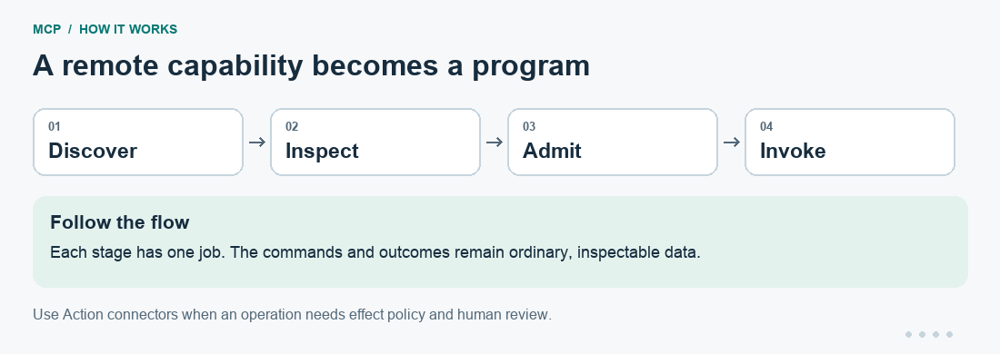
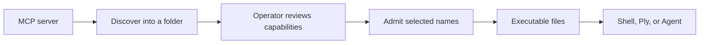

# MCP, as ordinary Unix programs

**Use an MCP service from your shell—or expose your own programs as an MCP service.**

An issue tracker may offer an MCP tool while your worker knows how to run
programs. This component connects those two interfaces. Send JSON on stdin,
get the result on stdout, and branch on the exit status. You can also turn
reviewed capabilities into executable files that an agent can use through PATH.

| Program | What it does |
| --- | --- |
| `mcp` | Make one request using the stateless `2026-07-28` protocol |
| `mcp-legacy` | Make one request using an explicitly selected earlier protocol lifecycle |
| `mcpbox` | Discover capabilities, inspect them, and admit selected ones as programs |
| `mcpserve` | Expose an ordinary dispatcher program as an MCP server |

[Install](#install) · [First request](#make-your-first-request) ·
[Toolbox](#turn-a-capability-into-a-command) · [Serve your own tools](#serve-your-own-programs)

## Install

From the [Bench tools monorepo](https://github.com/patrickyoung/bench-tools),
run `python3 scripts/install mcp` at the repository root. See
[installation and updates](https://github.com/patrickyoung/bench-tools/blob/main/docs/INSTALL.md)
for prerequisites and PATH setup, or
[getting started](https://github.com/patrickyoung/bench-tools/blob/main/docs/GETTING-STARTED.md)
for a guided first result.

**Standalone install.** Requires **Go 1.26+**, Git, and a Unix shell. Clone
current `main`:

```sh
git clone https://github.com/patrickyoung/mcp.git
cd mcp
./install.sh
export PATH="$HOME/.local/bin:$PATH"
mcp help
```

The installer runs the tests and installs all four commands under
`~/.local/bin`. Use `./install.sh -prefix DIR` for `DIR/bin`. Keep the PATH
setting in your shell startup file.

## Make your first request

The included hello server needs no account, model, or public service. Run these
examples from MCP's source directory: `cd tools/mcp` from the monorepo root,
or stay in the standalone `mcp` checkout.

```sh
printf '%s\n' '{"name":"hello","arguments":{"name":"Unix"}}' |
  mcp request tools/call -- go run ./examples/hello-server
```

You receive an MCP result object with a greeting in its `content`. The endpoint
comes after `--`; here it is the exact command used to start the local server.
The first `go run` may download Go dependencies.

Discover what that server offers:

```sh
mcp discover -- go run ./examples/hello-server
printf '%s\n' '{}' | mcp request tools/list -- go run ./examples/hello-server
```

For Streamable HTTP, replace the server command with one URL:

```sh
printf '%s\n' '{}' | mcp request tools/list -- https://YOUR_SERVICE/mcp
```

Replace the URL with a service that supports the selected protocol. Earlier
servers require `mcp-legacy`; there is no hidden fallback.



[Static version of the diagram](docs/readme/flow.png). This illustrates the workflow; it is not a recorded run.

## Turn a capability into a command

First create and inspect a capability folder:

```sh
mcpbox make hello.mcp -- go run ./examples/hello-server
mcpbox show hello.mcp
mcpbox tools hello.mcp
```

Discovery has not authorized any operation. Admit the `hello` tool explicitly:

```sh
mcpbox admit hello.mcp tools hello
printf '%s\n' '{"name":"Pike"}' | ./hello.mcp/tools/hello
```

The wrapper accepts only that tool's argument object. It pins the endpoint,
name, and reviewed descriptor digest, and checks the descriptor immediately
before a call. A changed or missing capability is refused.

For this demo, keep invoking from the repository directory because the recorded
endpoint uses a relative `go run` path. For a reusable deployment, build the
server and create the folder with its stable absolute executable path.



[Ply](https://github.com/patrickyoung/bench-tools/tree/main/tools/ply) and
[Agent](https://github.com/patrickyoung/bench-tools/tree/main/tools/agent) can use admitted programs as a
toolbox. They need no MCP implementation of their own. MCPbox is provisioning;
generated programs invoke the selected MCP client directly.

Build the expert with [Hire](https://github.com/patrickyoung/bench-tools/tree/main/tools/hire),
then provision its reviewed capabilities as programs. This keeps protocol
discovery and admission outside the expert's instructions: knowing that a
service exists does not grant a worker access to it.

## Keep effectful tools behind Action

For a tool that changes something, admit an
[Action](https://github.com/patrickyoung/bench-tools/tree/main/tools/action) connector:

```sh
mcpbox admit service.mcp actions create_ticket
```

Use that inspected folder's `actions/` directory as `ACTION_PATH`, then submit
a proposal through Action. Action owns operator policy, May review, request
release, and receipts. Server annotations such as a read-only hint do not
grant authority. Admitting the same tool under `tools/` deliberately permits
direct invocation, so choose the appropriate path.

## Authenticate without putting tokens in argv

With an [OAuth](https://github.com/patrickyoung/bench-tools/tree/main/tools/oauth) profile:

```sh
oauth with docs -- mcp discover -header-fd 3 -- https://YOUR_SERVICE/mcp
```

OAuth refreshes when needed and passes the header on descriptor 3. Alternatively,
an operator-owned header file can be opened with `3<headers`. Protocol headers
such as `Mcp-*`, Host, and framing fields cannot be injected this way.
For generated HTTP capability folders, `MCP_HEADERS` names the header file at
invocation time; credentials are not stored in the folder.

## Select legacy compatibility explicitly

`mcp-legacy` supports the SDK lifecycle for `2025-11-25`, `2025-06-18`,
`2025-03-26`, and `2024-11-05` servers:

```sh
mcp-legacy discover -- /absolute/path/to/your-server
mcpbox make -mcp "$(command -v mcp-legacy)" legacy.mcp -- \
  /absolute/path/to/your-server
```

Replace the server path with an installed executable and its literal arguments.
The generated folder retains the selected compatibility client. Legacy stdio
and Streamable HTTP are supported where the revision defines them; deprecated
HTTP+SSE transport and modern `subscriptions/listen` are not legacy features.

## Use more than tools

The request boundary covers discovery, tools, prompts, resource lists and
reads, resource templates, completion, subscriptions, and extension methods
including Tasks. For an inspected folder that actually offers these capabilities:

```sh
mcpbox admit service.mcp prompts review
mcpbox admit service.mcp resources 'repo://README.md'
mcpbox admit service.mcp templates 'repo://file/{path}'
```

Prompts, exact resources, and templates are separate grants. Template reads
validate both the reviewed descriptor and concrete RFC 6570 expansion.

`mcp listen -- ENDPOINT` emits JSONL notifications until interrupted or
disconnected. Empty stdin selects list changes; explicit JSON can select
subscriptions. It never reconnects silently.

`input_required` and nonterminal Tasks return intact with exit 75. The caller
retains the state, obtains the needed input, and issues another request.
Progress can be sent as JSONL on `-event-fd 3`. `-timeout`, `-max-input`, and
`-max-output` provide explicit bounds; there is no default request timeout.

To review a changed service, create a new folder and compare it with
`mcpbox diff OLD NEW`. New discovery does not inherit old admission by name.

## Serve your own programs

Try the supplied dispatcher:

```sh
printf '%s\n' '{"name":"hello","arguments":{"name":"Unix"}}' |
  mcp request tools/call -- \
  mcpserve examples/filter-server/manifest.json -- examples/filter-server/dispatch
```

The manifest supplies capability descriptions. For each call, MCPserve appends
the method to the dispatcher's literal argv, writes params to stdin, and reads
one result object from stdout. Stderr remains diagnostics; descriptor 3 can
carry request notifications. The SDK handles discovery and protocol framing.

```text
MCP request → mcpserve → dispatch tools/call → your program
MCP result  ← mcpserve ← JSON result        ← your program
```

Use `mcpserve -http 127.0.0.1:8080 MANIFEST -- DISPATCH` for a local HTTP
listener. Nonlocal deployments need operator-managed TLS and authentication.
Manifests remain fixed for a process lifetime. Task persistence belongs to the
dispatcher or a tool such as Tend, not a hidden MCPserve database.

## Outcomes and development

| Exit | Meaning |
| --- | --- |
| 0 | Complete positive result |
| 1 | Complete peer/application negative, including `isError` |
| 2 | Usage, validation, discovery, or pre-transmission failure |
| 75 | Valid but unfinished: input needed or a nonterminal Task |
| 125 | Request transmitted without a unique trustworthy terminal result |
| 130 | Interrupted before transmission |

Once a request may have caused an effect, **125 must not trigger an automatic
retry**. Inspect the service and evidence first. Each request is independent;
there is no endpoint registry, token database, or background agent loop.

Run each command's `help` for its options. See [DESIGN.md](DESIGN.md),
[SECURITY.md](SECURITY.md), and [examples](examples). Contributors: read
[AGENTS.md](AGENTS.md), then run `go test ./...` and `go test -race ./...`.
[MIT license](LICENSE).
