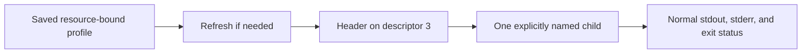

# OAuth

**Log in once, refresh when needed, and hand a credential to one command.**

A worker's job description says what it should do. A service credential says
which identity is asking for access. OAuth connects an ordinary Unix program
to an OAuth-protected resource. It
handles login and refresh, then gives the selected child one Authorization
header on file descriptor 3. The child keeps its normal stdin and stdout;
access tokens do not need to appear in command arguments or environment variables.

```sh
oauth with docs -- mcp discover -header-fd 3 -- https://YOUR_SERVICE/mcp
```

This requires a configured `docs` profile and a real service URL. The steps
below create that profile.

## Install

From the [Bench tools monorepo](https://github.com/patrickyoung/bench-tools),
run `python3 scripts/install oauth` at the repository root. See
[installation and updates](https://github.com/patrickyoung/bench-tools/blob/main/docs/INSTALL.md)
for prerequisites and PATH setup, or
[getting started](https://github.com/patrickyoung/bench-tools/blob/main/docs/GETTING-STARTED.md)
for a guided first result.

**Standalone install.** Requires **Go 1.26+**, Git, and a Unix environment.
Clone current `main`:

```sh
git clone https://github.com/patrickyoung/oauth.git
cd oauth
./install.sh
export PATH="$HOME/.local/bin:$PATH"
oauth help
```

The installer tests and builds the program into `~/.local/bin`. Use
`./install.sh -prefix DIR` for `DIR/bin`, and keep the PATH setting in your
shell startup file.

## Before your first login

You need two values from the service you are connecting to:

- **Resource URL:** the API or MCP resource that will receive the credential.
- **Client ID:** a registered client accepted by its authorization server.

For a public command-line client, use authorization code with PKCE; there is
no embedded client secret. If your provider issued a secret, use the
confidential-client instructions below. This tool does not register an app
for you or import a provider-specific CLI login.

## Connect and make one request

Replace the placeholders with your resource and client ID:

```sh
oauth discover https://YOUR_SERVICE/mcp
oauth login docs -client-id YOUR_CLIENT_ID https://YOUR_SERVICE/mcp
oauth status docs
```

Follow the browser login instructions. OAuth checks the callback and saves
the profile. `status` shows non-secret information; it never prints a token.
The profile name `docs` is your local name for this exact connection.

With [MCP](https://github.com/patrickyoung/bench-tools/tree/main/tools/mcp) installed:

```sh
oauth with docs -- \
  mcp request -header-fd 3 tools/list -- https://YOUR_SERVICE/mcp
```

You should receive the service's tool-list result on stdout. If a refresh is
needed, it happens **before** MCP starts. OAuth never retries the child command.



## Choose the login flow the service supports

| Need | Options |
| --- | --- |
| Browser sign-in for a public CLI | `-flow code -client-id ID` |
| Device code sign-in | `-flow device -client-id ID` |
| Machine-to-machine credentials | `-flow client-credentials` plus client authentication |
| Explicit scopes | `-scope 'files:read files:write'` |
| Show the authorization URL without opening a browser | `-no-browser` |

The server must support the selected flow. Code login uses PKCE S256, a random
state, and an exact loopback callback on `127.0.0.1`. Device login prints the
verification URI and user code on stderr and observes polling/expiry limits.

### A client secret stays out of arguments

Use an operator-owned file with mode 0600 or stricter:

```sh
oauth login build -flow client-credentials \
  -client-id YOUR_CLIENT_ID \
  -client-auth client_secret_basic \
  -client-secret-file /absolute/path/to/protected-secret \
  https://YOUR_SERVICE/api
```

Or pipe a secret from your credential manager into `login` with
`-client-secret-stdin`. There is no `-client-secret VALUE` flag.
`client_secret_post` is also available when required. The selected method is
checked against server metadata when advertised.

### A service without discovery metadata

Supply its boundaries explicitly:

```sh
oauth login legacy \
  -issuer https://YOUR_LOGIN_SERVICE \
  -authorization-endpoint https://YOUR_LOGIN_SERVICE/authorize \
  -token-endpoint https://YOUR_LOGIN_SERVICE/token \
  -client-id YOUR_CLIENT_ID \
  https://YOUR_API_RESOURCE
```

All values are placeholders. Use the service's documented endpoints and
resource identity; endpoints remain validated before storage and use.

## Connect to Ask or your own program

The same credential handoff works for a remote agent with
[A2A](https://github.com/patrickyoung/bench-tools/tree/main/tools/a2a). After
creating a `reports` profile for the worker's protected resource:

```sh
oauth with reports -- a2a request -header-fd 3 \
  send https://YOUR_WORKER/rpc < request.json > result.json
```

Use A2A's documented request shape and check the child's status: an accepted
but unfinished task returns 75. OAuth handles authentication; it does not
decide that the remote task is complete or retry the request.

[Ask](https://github.com/patrickyoung/bench-tools/tree/main/tools/ask) accepts the same header boundary:

```sh
oauth with llm -- ask -header-fd 3 -m openai/YOUR_MODEL_ID 'Hello.'
```

Create `llm` for the exact resource and authentication setup accepted by your
model service first. Choosing a model name does not create an OAuth profile or
guarantee that a particular provider accepts this login flow.

Your own child can use the same inherited descriptor. `oauth with` invokes
literal argv after `--`, without a shell, and preserves standard streams and
child status. It binds credentials to the profile's resource, issuer, client,
and requested scopes. Protocol clients still own where they send the header.

For comparison, [Vouch](https://github.com/patrickyoung/vouch) also supports
imported CLI credentials, static keys, and browser-session references. OAuth
supplies the explicit OAuth lifecycle and descriptor transfer used by Ask, MCP, and A2A;
neither tool supplies permission to perform a particular external action.
[Action](https://github.com/patrickyoung/bench-tools/tree/main/tools/action) and
[May](https://github.com/patrickyoung/bench-tools/tree/main/tools/may) provide that separate boundary.

## Manage a connection

```sh
oauth status
oauth refresh docs
oauth logout docs
```

State lives under `$OAUTH_HOME`, then `$XDG_STATE_HOME/oauth`, or
`~/.local/state/oauth`. Each private profile has separate definition and
credential files plus a stable lock. Refresh is serialized so a rotating
refresh token is not spent twice. Logout removes the local profile; consult
the provider when you also need remote revocation.

`oauth header docs` deliberately prints a secret header. Prefer `with` for
normal use so the header cannot accidentally become an ordinary output log.

## Troubleshooting and supported scope

If discovery fails, check the exact resource URL and its metadata. If login
fails, check the client registration, supported flow, scopes, and authentication
method. Token requests do not follow redirects. HTTPS is required except for
exact loopback endpoints.

The implementation supports authorization code with PKCE, resource metadata,
authorization-server/OIDC discovery, resource indicators, issuer checks, device
authorization, client credentials, refresh tokens, and bearer headers. It does
not approximate implicit/password grants, DPoP, mutual TLS, token exchange,
private-key assertions, dynamic registration, or provider-specific login imports.

```text
oauth discover [flags] RESOURCE
oauth login NAME [flags] RESOURCE
oauth refresh [flags] NAME
oauth status [NAME]
oauth logout NAME
oauth header [flags] NAME
oauth with [flags] NAME -- COMMAND [ARG...]
```

See [DESIGN.md](DESIGN.md) and [SECURITY.md](SECURITY.md). Contributors: read
[AGENTS.md](AGENTS.md), run `go test ./...` and `go test -race ./...`.
[MIT license](LICENSE).
