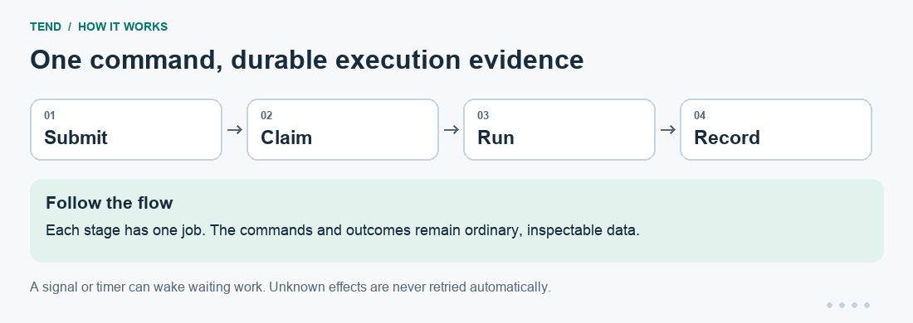
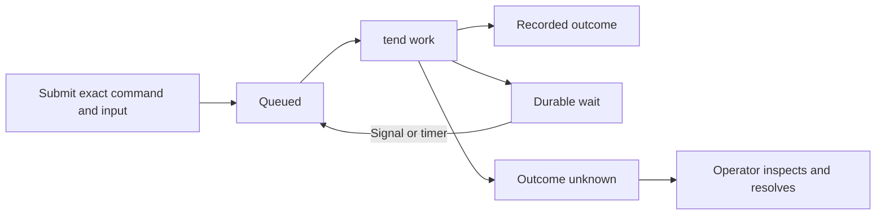

# Tend

**Put an ordinary command on a durable local queue, then see exactly what happened.**

A report should not disappear because the terminal that submitted it closed.
Tend saves a job's input, runs its exact command, and records the attempt and
output. It can wait for a signal or a timer and continue later. If a process
may have started but its outcome is unknown, Tend stops for an explicit decision
instead of quietly running it twice.

One `tend work` call performs one durable transition and exits. Your shell,
cron, launchd, systemd, or CI supplies the repetition.

## Install

From the [Bench tools monorepo](https://github.com/patrickyoung/bench-tools),
run `python3 scripts/install tend` at the repository root. See
[installation and updates](https://github.com/patrickyoung/bench-tools/blob/main/docs/INSTALL.md)
for prerequisites and PATH setup, or
[getting started](https://github.com/patrickyoung/bench-tools/blob/main/docs/GETTING-STARTED.md)
for a guided first result.

**Standalone install.** Requires **Go 1.26+** and a **Unix environment**.
Install current `main`:

```sh
mkdir -p "$HOME/.local/bin"
GOBIN="$HOME/.local/bin" go install github.com/patrickyoung/tend@main
export PATH="$HOME/.local/bin:$PATH"
tend version
```

Keep the PATH setting in your shell startup file. No model, account, or daemon
is needed. Use a local filesystem: Tend's SQLite state is single-host state.

## Run your first job

Choose a fresh directory for this example's queue:

```sh
export TEND_ROOT="$(mktemp -d)/queue"
id=$(printf '%s\n' 'Hello from a durable job' | tend submit -- /bin/cat)
tend list
tend work
tend show "$id"
tend events "$id"
tend check
```

The submitted text becomes `/bin/cat`'s stdin. `show` displays the job state;
`events` shows its recorded transitions. The job's result should be successful,
and `tend check` should verify its database and output bindings. The worker's
stdout is retained as an attempt artifact, not printed as `tend work` output.

Read this first attempt's actual result:

```sh
cat "$TEND_ROOT/jobs/$id/attempts/001.out"
```

It should be `Hello from a durable job`. Submission returns an ID, the worker
records an attempt, and the artifact holds the answer: three different outputs
for three different callers.

Each attempt stores separate `NNN.out` and `NNN.err` files. Tend records their
digests and sizes, so later inspection can detect changed evidence.



[Static version of the diagram](docs/readme/flow.png). This illustrates the workflow; it is not a recorded run.

## Keep taking work

For a simple foreground worker loop in a shell:

```sh
while :; do
  tend work
  work_status=$?
  case "$work_status" in
    0) ;;                 # performed a transition; look again
    1) sleep 1 ;;         # idle
    *) exit "$work_status" ;;  # controller failure or interruption
  esac
done
```

Run this without shell `set -e`, which would exit on the ordinary idle status.
Stop it with Ctrl+C. The operating system can run the same worker invocation
on a schedule; Tend has no required server process.

Jobs with the same working directory serialize by default. Use `-C DIR` to
choose the working directory and `-key KEY` to choose another serialization
domain. Commands are literal argv after `--`, not generated shell strings.

## Wait for input instead of polling a model

A submitted program can ask Tend to wait before it returns exit 75:

```sh
tend defer signal approved
exit 75
```

Those two lines belong **inside the submitted program**, not in your operator
terminal. Another process can wake the job:

```sh
tend signal JOB_ID approved
```

The job is invoked again with its durable signal available. See the complete
[wait-for-input example](examples/wait-for-input/README.md), which includes
the worker script and the commands to supply input.

For time-based waiting, the job can call `tend defer until 15m` before returning
75. For an initially scheduled job, use `submit -at` with an absolute RFC3339
time. A stable `-id` and the same request make submission safe to repeat.



## Understand an interrupted attempt

A prepared attempt can be requeued safely. Once the submitted command may have
started, missing a trustworthy outcome becomes **unknown**. Tend cannot know
whether an external service already accepted an effect.

After inspecting the service and recorded artifacts, choose explicitly:

```sh
tend resolve JOB_ID fail
tend resolve JOB_ID retry
tend resolve JOB_ID done
```

These are alternatives. `retry` accepts possible duplicate effects. `done`
requires the completion check supplied with `submit -check` to exit zero.
Known failed jobs use `tend retry JOB_ID`; cancellation uses `tend cancel JOB_ID`.
Neither a successful controller command nor a model's prose proves an external
effect happened exactly once.

An unknown attempt keeps its serialization fence. A private launcher stops
the submitted process group if the controller disappears; resolution waits
until the launcher is gone and partial output is sealed.

## Compose it with Bench tools

- [Agent](https://github.com/patrickyoung/bench-tools/tree/main/tools/agent): submit one `agent run` with a
  named checkpoint. See [agent-checkpoint](examples/agent-checkpoint/README.md).
- [May](https://github.com/patrickyoung/bench-tools/tree/main/tools/may): park an approval request and wake
  it after a human decision. See [may-approval](examples/may-approval/README.md).
- [Ply](https://github.com/patrickyoung/bench-tools/tree/main/tools/ply): keep a checked model task's
  command, input, output, and execution outcome durable.
- [Hire](https://github.com/patrickyoung/bench-tools/tree/main/tools/hire): build
  the expert folder before submitting its Agent invocation. Hire is the
  headless builder; it does not own the queue.
- [A2A](https://github.com/patrickyoung/bench-tools/tree/main/tools/a2a): expose
  an admitted command to remote callers. A2Aserve uses Tend for each local
  attempt and retains remote task identity separately.

Tend owns execution facts. Ask still owns model conversations; a checkpoint
preserves context without resolving uncertain effects.

## Settings and reference

| Variable | Purpose |
| --- | --- |
| `TEND_ROOT` | State directory; default `~/.local/state/tend` |
| `TEND_LEASE` | Positive lease duration |
| `TEND_JOB_MAX` | Positive maximum job duration |
| `TEND_CHECK_MAX` | Positive maximum completion-check duration |
| `TEND_PASS` | Space-separated extra environment variable names passed to jobs/checks |

The submitted child does not inherit every ambient environment variable.
Explicitly allow required credential/routing names when composing a model
client; Tend's records should contain names, not secret values.

`work` exits 0 after a durable action, 1 when idle, 2 on controller failure,
and 130 when interrupted after execution starts. Other commands use 0 for
success, 1 for a negative result, and 2 for usage/controller failure. Inspect
the job record to learn the child's outcome.

```text
tend submit [options] -- COMMAND [ARG...]
tend work
tend list
tend show ID
tend events [ID]
tend signal [-id ID] JOB NAME [PAYLOAD...]
tend signals [JOB]
tend defer signal NAME | until TIME | manual
tend retry ID
tend resolve ID retry|done|fail
tend cancel ID
tend export
tend check
tend help
tend version
```

See [DESIGN.md](DESIGN.md) and [SECURITY.md](SECURITY.md). Contributors: read
[AGENTS.md](AGENTS.md), then run `go test ./...` and `go test -race ./...`.
[MIT license](LICENSE).
